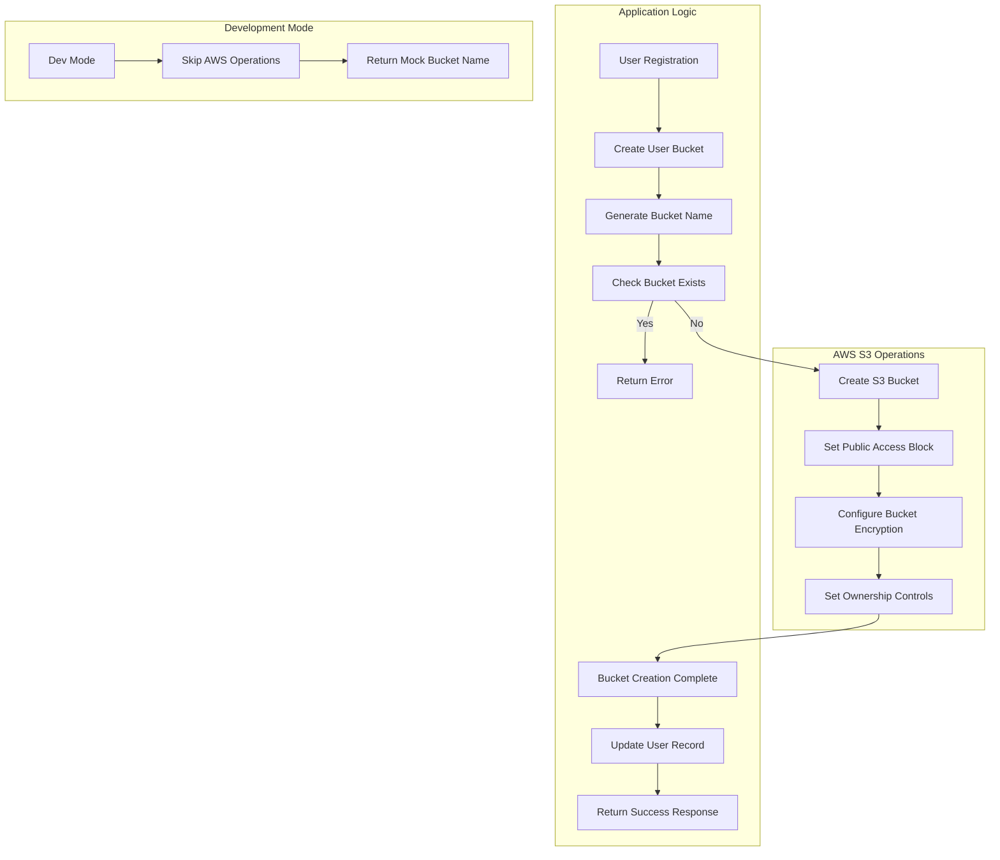

# AWS S3 Bucket Creation Flow Diagram

## Overview
This diagram illustrates the complete flow for creating and configuring an AWS S3 bucket in the SkyCrate application.



## Detailed Flow Description

### 1. User Registration
- New user signs up through the application
- User authentication is established
- System prepares to create personal storage bucket

### 2. Create User Bucket
- [`createUserBucket()`](server/services/awsService.js:58) function is called
- Bucket naming convention is applied (typically user ID based)

### 3. Generate Bucket Name
- System generates unique bucket name using user ID
- Format: `skycrate-{userId}-{timestamp}`
- Ensures global uniqueness across AWS

### 4. Check Bucket Exists
- [`checkBucketExists()`](server/services/awsService.js:355) verifies bucket doesn't already exist
- Uses [`HeadBucketCommand`](server/services/awsService.js:361) to check bucket status
- Prevents naming conflicts

### 5. Create S3 Bucket
- [`CreateBucketCommand`](server/services/awsService.js:74) creates the bucket
- Region-specific configuration applied:
  - For `us-east-1`: No LocationConstraint needed
  - For other regions: [`LocationConstraint: { LocationConstraint: config.AWS_REGION }`](server/services/awsService.js:69)

### 6. Set Public Access Block
- [`PutPublicAccessBlockCommand`](server/services/awsService.js:79) configures security:
  - `BlockPublicAcls: true`
  - `IgnorePublicAcls: true`
  - `BlockPublicPolicy: true`
  - `RestrictPublicBuckets: true`

### 7. Configure Bucket Encryption
- [`PutBucketEncryptionCommand`](server/services/awsService.js:92) sets encryption:
  - [`ServerSideEncryptionConfiguration`](server/services/awsService.js:94)
  - [`SSEAlgorithm: 'AES256'`](server/services/awsService.js:97)
  - Ensures all data is encrypted at rest

### 8. Set Ownership Controls
- [`PutBucketOwnershipControlsCommand`](server/services/awsService.js:106) configures ownership:
  - [`ObjectOwnership: 'BucketOwnerEnforced'`](server/services/awsService.js:109)
  - Prevents ACLs and ensures bucket owner has full control

### 9. Bucket Creation Complete
- All AWS S3 operations completed successfully
- Bucket is fully configured and ready for use

### 10. Update User Record
- User database record updated with bucket information
- Bucket name and configuration stored in [`users.json`](server/data/users.json)
- User can now access their personal storage

### 11. Return Success Response
- Success response sent to client
- Bucket information returned for frontend display

### 12. Development Mode Flow
- When [`config.DEV_MODE`](server/services/awsService.js:59) is enabled:
  - All AWS operations are skipped
  - Mock bucket name returned
  - No actual S3 bucket created

## Error Handling

### Common Error Scenarios:
1. **Bucket Already Exists**
   - Error: `BucketAlreadyOwnedByYou`
   - Solution: Regenerate bucket name with different suffix

2. **Invalid Bucket Name**
   - Error: `InvalidBucketName`
   - Solution: Ensure bucket name follows AWS naming conventions

3. **Access Denied**
   - Error: `AccessDenied`
   - Solution: Verify AWS IAM credentials and permissions

4. **Bucket Not Empty**
   - Error: `BucketNotEmpty`
   - Solution: Clean bucket before deletion (handled in [`deleteS3BucketCompletely()`](server/services/awsService.js:128))

## Configuration Details

### AWS S3 Client Initialization
```javascript
const s3Client = new S3Client({
  credentials: {
    accessKeyId: config.AWS_ACCESS_KEY_ID,
    secretAccessKey: config.AWS_SECRET_ACCESS_KEY,
  },
  region: config.AWS_REGION
});
```

### Bucket Creation Parameters
```javascript
const createParams = { 
  Bucket: bucketName 
};
if (config.AWS_REGION !== 'us-east-1') {
  createParams.CreateBucketConfiguration = { 
    LocationConstraint: config.AWS_REGION 
  };
}
```

## Security Considerations

1. **Public Access Block**: Prevents accidental public access
2. **Server-Side Encryption**: All data encrypted at rest with AES256
3. **Ownership Controls**: Enforces bucket owner full control
4. **IAM Permissions**: Minimal required permissions for bucket operations

## Performance Notes

- All AWS operations are sequential and synchronous
- Each step includes logging for debugging
- Error handling at each step ensures proper cleanup
- Development mode bypasses all AWS operations for testing

## Related Files

- [`server/services/awsService.js`](server/services/awsService.js) - Main AWS S3 operations
- [`server/services/storageService.js`](server/services/storageService.js) - Storage class management
- [`server/routes/storage.js`](server/routes/storage.js) - Storage analytics routes
- [`server/config/environment.js`](server/config/environment.js) - Configuration settings