# SkyCrate Data Flow Architecture

## Main Data Flow Diagram

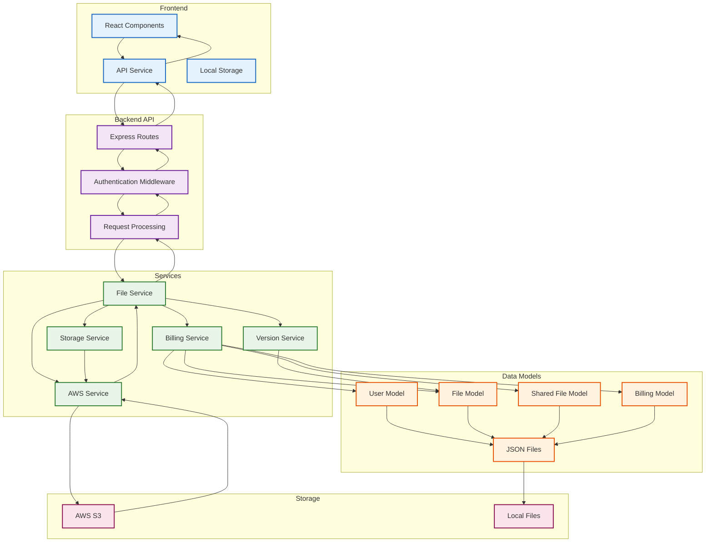

## Core Data Flows

### 1. User Registration Data Flow
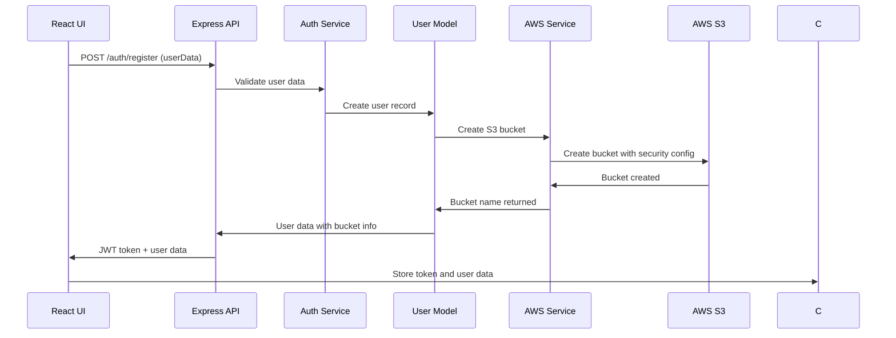

### 2. File Upload Data Flow
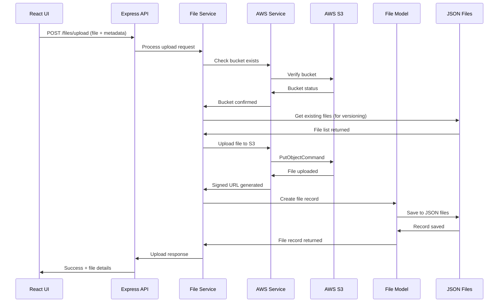

### 3. File Download Data Flow
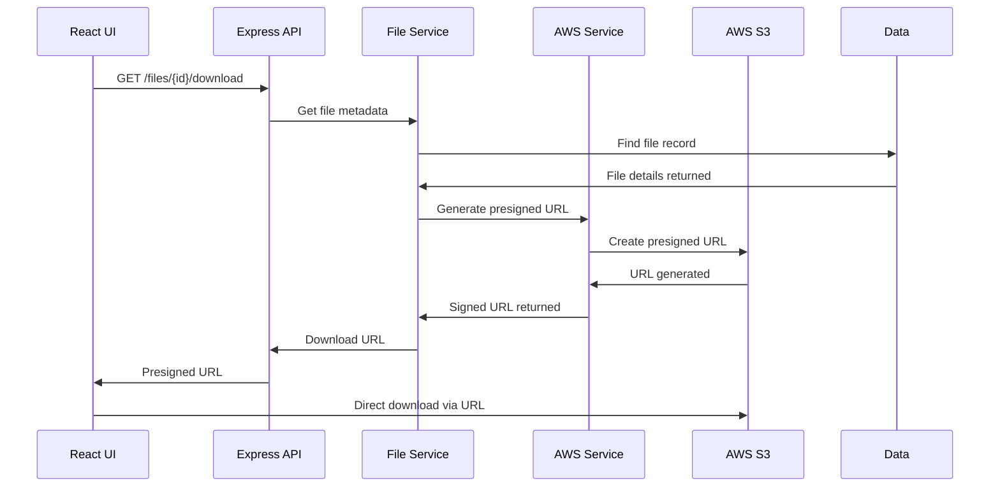

### 4. File Sharing Data Flow
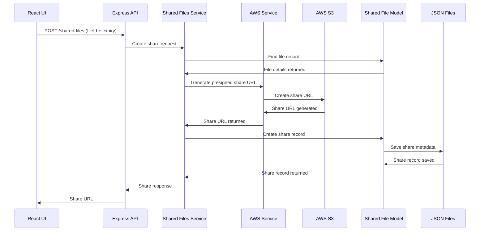

### 5. File Deletion Data Flow
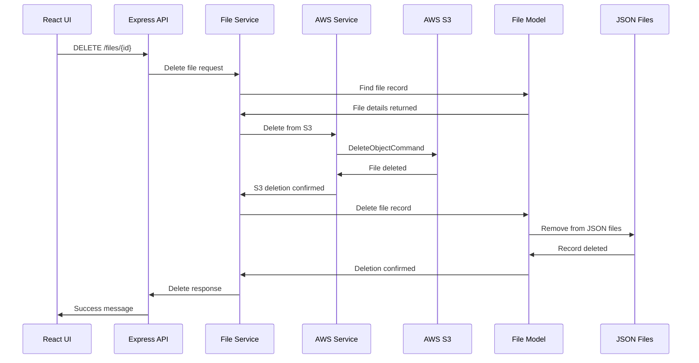

### 6. Storage Class Change Data Flow
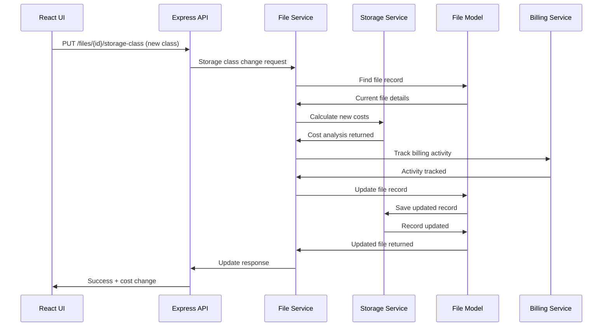

### 7. User Authentication Data Flow
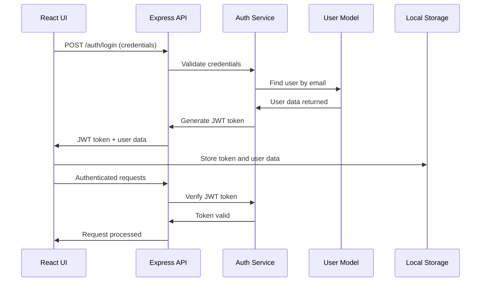

### 8. Billing Data Flow
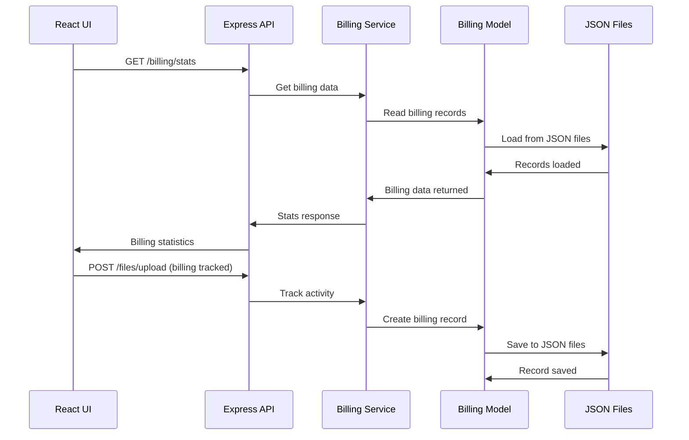

## Data Persistence Flow

### JSON File Storage Flow
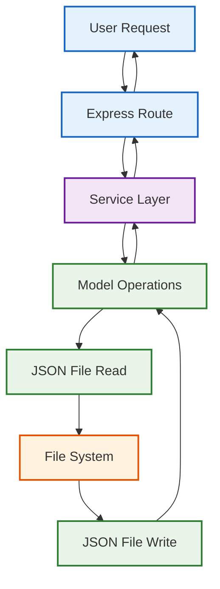

## Error Handling Data Flow

### Error Propagation Flow
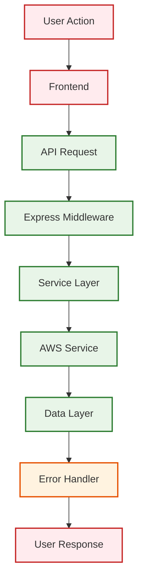

## Data Flow Characteristics

### Synchronous Operations
- User authentication
- File metadata updates
- Storage class changes
- Billing calculations

### Asynchronous Operations
- File uploads to AWS S3
- File downloads via presigned URLs
- Share URL generation
- AWS bucket operations

### Data Transformation Points
1. **Request Validation**: Input sanitization and validation
2. **Data Serialization**: JSON conversion for file storage
3. **URL Generation**: Presigned URL creation for secure access
4. **Cost Calculation**: Storage cost optimization and billing
5. **Version Management**: File version tracking and updates

### Cache Layers
- **Frontend**: React state management
- **API**: Request/response caching
- **Service**: In-memory service state
- **Storage**: File system caching

This data flow architecture shows how information moves through the SkyCrate system from user interactions to persistent storage, with proper error handling and data transformation at each stage.