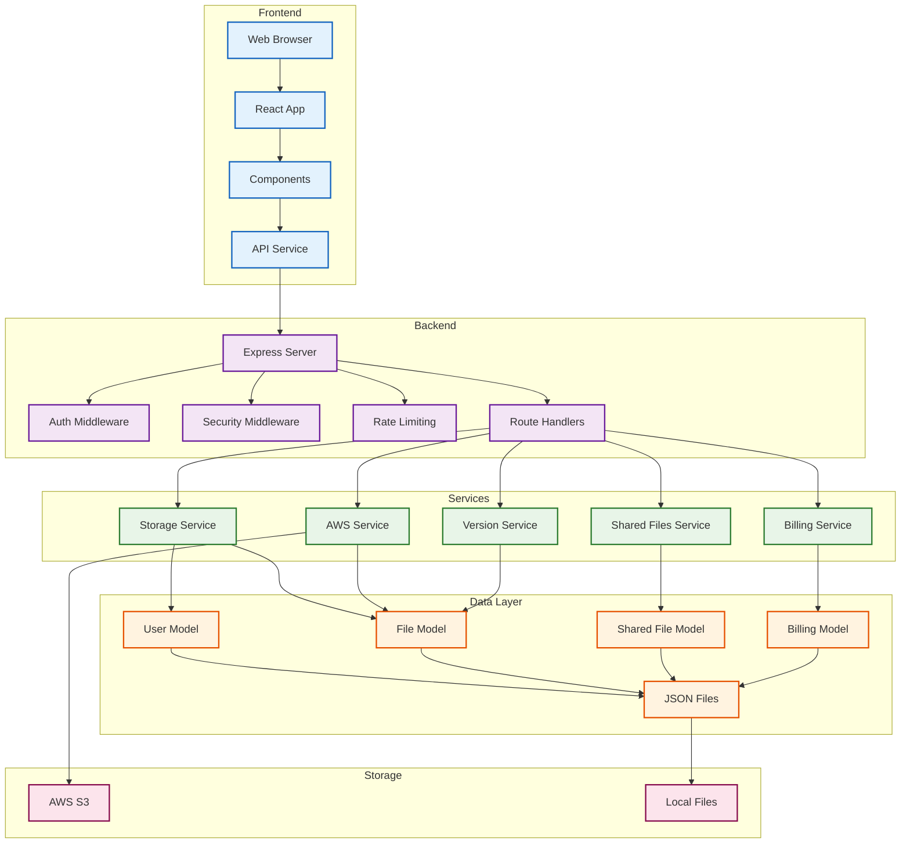

# SkyCrate Simple System Architecture

## Current System Architecture

## Core Functional Components

### 1. Frontend Layer
- **React Application**: User interface built with React.js
- **Components**: Reusable UI components for different features
- **API Service**: Handles communication with backend services
- **State Management**: React Context for global state

### 2. Backend Layer
- **Express Server**: Main application server
- **Authentication**: JWT-based user authentication
- **Security**: Helmet, CORS, and rate limiting middleware
- **Route Handlers**: Modular route handling for different domains

### 3. Service Layer
- **Storage Service**: Manages storage class optimization and recommendations
- **AWS Service**: Handles AWS S3 operations (bucket creation, file upload/download)
- **Billing Service**: Calculates costs and manages billing information
- **Version Service**: Manages file versioning and history
- **Shared Files Service**: Handles file sharing functionality

### 4. Data Layer
- **User Model**: User data management and authentication
- **File Model**: File metadata, versioning, and relationships
- **Shared File Model**: File sharing and access control
- **Billing Model**: Usage tracking and cost calculations
- **JSON Files**: File-based data persistence

### 5. Storage Layer
- **AWS S3**: Primary cloud storage for user files
- **Local Files**: Development and temporary file storage

## Key Features Implemented

### Authentication & User Management
- User registration and login
- JWT-based authentication
- User profile management
- Account deletion with cleanup

### File Management
- File upload with storage class selection
- File download with presigned URLs
- File deletion and bulk operations
- File metadata management

### Storage Optimization
- Multiple AWS storage classes (STANDARD, STANDARD_IA, ONEZONE_IA, GLACIER, etc.)
- Automatic storage class recommendations
- Cost optimization based on file characteristics
- Storage analytics and statistics

### File Versioning
- Automatic versioning on file re-upload
- Version history tracking
- Version restoration
- Legacy file migration to versioned structure

### File Sharing
- Secure file sharing with presigned URLs
- Expiry time configuration
- Share management and tracking
- Access control

### Billing & Cost Management
- Usage tracking and statistics
- Cost calculations with margins
- Billing history and details
- Storage cost analysis

## Data Flow

### User Registration Flow
1. User submits registration form
2. React app sends request to Express server
3. Server validates input and creates user
4. AWS bucket is created for the user
5. User data is stored in JSON files
6. JWT token is generated and returned

### File Upload Flow
1. User selects file and storage class
2. React app sends file to Express server
3. Server uploads file to AWS S3
4. File metadata is stored in JSON files
5. Version information is recorded
6. Response with file details is returned

### File Download Flow
1. User requests file download
2. React app requests download URL
3. Server generates presigned S3 URL
4. URL is returned to client
5. Client downloads file directly from S3

### File Sharing Flow
1. User initiates file sharing
2. Server generates presigned share URL
3. Share metadata is stored
4. URL is provided to user
5. Shared files can be accessed via URL

## Technology Stack

### Frontend
- **React.js**: UI framework
- **Axios**: HTTP client
- **HTML5/CSS3**: Markup and styling
- **JavaScript ES6+**: Modern JavaScript features

### Backend
- **Node.js**: Runtime environment
- **Express.js**: Web framework
- **JWT**: Authentication
- **Multer**: File upload handling
- **dotenv**: Environment management

### Cloud Services
- **AWS S3**: Object storage
- **AWS IAM**: Identity management

### Data Storage
- **JSON Files**: Data persistence
- **File System API**: File operations
- **Crypto Module**: Security features

## Current Limitations

### Single Server Architecture
- No load balancing or clustering
- Single point of failure
- Limited horizontal scaling

### File-based Storage
- No database for structured data
- Limited query capabilities
- File system dependency

### Basic Security
- JWT authentication only
- No advanced security features
- Limited access control beyond basic sharing

### Simple Monitoring
- Basic console logging
- No comprehensive monitoring
- Limited error tracking

This architecture represents the current implemented functionality of the SkyCrate application, focusing on core file management, storage optimization, versioning, and sharing capabilities.