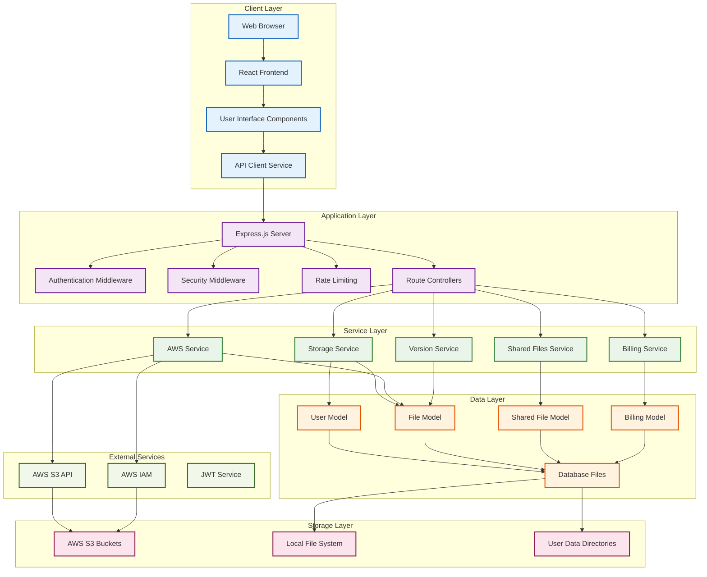
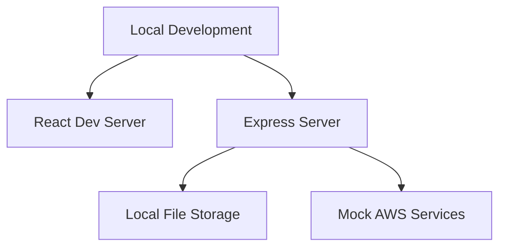
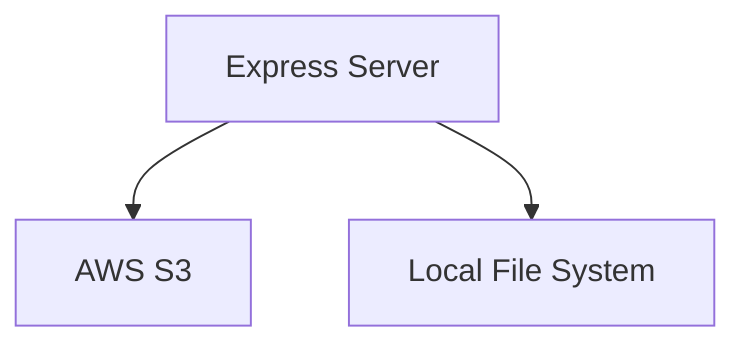
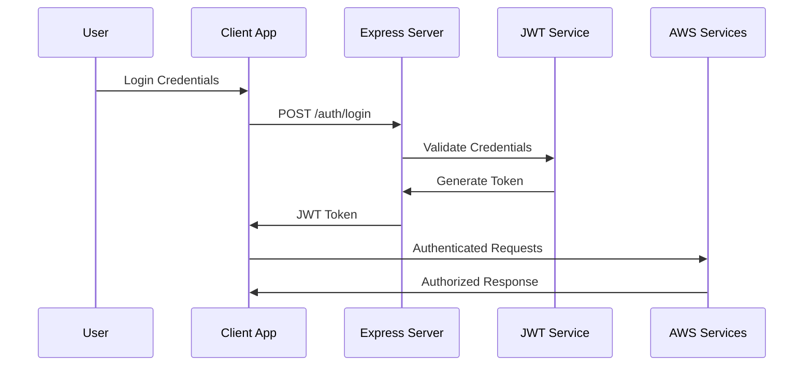
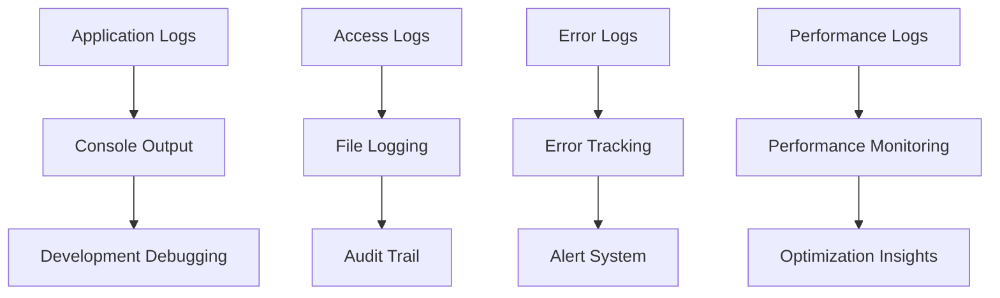

# SkyCrate System Architecture Overview

## High-Level Architecture Diagram



## Architecture Components

### 1. Client Layer
**Technology**: React.js, Axios, HTML5, CSS3
**Responsibilities**: User interface, user interactions, API communication

**Key Components**:
- **React Frontend** ([`src/`](src/)): Main application interface
- **UI Components** ([`src/components/`](src/components/)): Reusable UI elements
- **API Service** ([`src/services/api.js`](src/services/api.js)): Centralized API communication
- **Context Providers** ([`src/contexts/`](src/contexts/)): Global state management

### 2. Application Layer
**Technology**: Node.js, Express.js, Middleware
**Responsibilities**: Request handling, authentication, security, routing

**Key Components**:
- **Express Server** ([`server/app.js`](server/app.js)): Main application server
- **Authentication** ([`server/middleware/auth.js`](server/middleware/auth.js)): JWT-based authentication
- **Security** ([`server/middleware/security.js`](server/middleware/security.js)): Helmet, CORS, rate limiting
- **Route Controllers** ([`server/routes/`](server/routes/)): Domain-specific route handlers

### 3. Service Layer
**Technology**: JavaScript ES6+, Async/Await
**Responsibilities**: Business logic, external service integration, data processing

**Key Services**:
- **Storage Service** ([`server/services/storageService.js`](server/services/storageService.js)): Storage class optimization
- **AWS Service** ([`server/services/awsService.js`](server/services/awsService.js)): AWS S3 operations
- **Billing Service** ([`server/services/billingService.js`](server/services/billingService.js)): Cost calculations
- **Version Service** ([`server/services/versionService.js`](server/services/versionService.js)): File versioning
- **Shared Files Service** ([`server/services/sharedFilesService.js`](server/services/sharedFilesService.js)): File sharing

### 4. Data Layer
**Technology**: File-based JSON storage, Model-View-Controller pattern
**Responsibilities**: Data persistence, data access, data relationships

**Key Models**:
- **User Model** ([`server/models/User.js`](server/models/User.js)): User data management
- **File Model** ([`server/models/File.js`](server/models/File.js)): File metadata and versioning
- **Shared File Model** ([`server/models/SharedFile.js`](server/models/SharedFile.js)): Sharing functionality
- **Billing Model** ([`server/models/Billing.js`](server/models/Billing.js)): Billing and usage tracking

### 5. Storage Layer
**Technology**: AWS S3, Local File System
**Responsibilities**: File storage, data persistence, backup and recovery

**Storage Systems**:
- **AWS S3**: Primary production storage
- **Local File System**: Development and temporary storage
- **User Data Directories**: Organized user-specific storage

### 6. External Services
**Technology**: AWS APIs, JWT Libraries
**Responsibilities**: Cloud services, authentication, monitoring

**External Integrations**:
- **AWS S3 API**: File storage and retrieval
- **AWS IAM**: Identity and access management
- **JWT Service**: Authentication token management
- **Monitoring/Logging**: Application monitoring and logging

## Technology Stack

### Frontend Technologies
- **React.js**: UI framework for building user interfaces
- **Axios**: HTTP client for API communication
- **HTML5/CSS3**: Markup and styling
- **JavaScript ES6+**: Modern JavaScript features
- **React Context API**: State management

### Backend Technologies
- **Node.js**: JavaScript runtime environment
- **Express.js**: Web application framework
- **JWT**: JSON Web Token for authentication
- **Multer**: File upload handling
- **dotenv**: Environment variable management

### Cloud Technologies
- **AWS S3**: Object storage service
- **AWS IAM**: Identity and access management
- **AWS CloudWatch**: Monitoring and logging
- **AWS Lambda**: Serverless computing (potential future enhancement)

### Data Technologies
- **JSON File Storage**: Lightweight data persistence
- **File System API**: File system operations
- **Crypto Module**: UUID generation and security

## Architecture Patterns

### 1. Layered Architecture
The system follows a strict layered architecture pattern with clear separation of concerns:

```
┌─────────────────────────────────────────────────────────────┐
│                    Client Layer                              │
│                   (React Frontend)                          │
├─────────────────────────────────────────────────────────────┤
│                   Application Layer                          │
│                (Express.js + Middleware)                    │
├─────────────────────────────────────────────────────────────┤
│                     Service Layer                           │
│              (Business Logic + External Services)           │
├─────────────────────────────────────────────────────────────┤
│                      Data Layer                             │
│                   (Models + Data Access)                    │
├─────────────────────────────────────────────────────────────┤
│                     Storage Layer                           │
│                (AWS S3 + Local Storage)                     │
└─────────────────────────────────────────────────────────────┘
```

### 2. Model-View-Controller (MVC) Pattern
- **Model**: Data layer ([`server/models/`](server/models/))
- **View**: Frontend components ([`src/components/`](src/components/))
- **Controller**: Route handlers ([`server/routes/`](server/routes/))

### 3. Service Layer Pattern
Business logic is encapsulated in service classes:
- **Storage Service**: Handles storage class optimization
- **AWS Service**: Manages AWS S3 operations
- **Billing Service**: Processes billing calculations
- **Version Service**: Manages file versioning

### 4. Repository Pattern
Data access is abstracted through model classes:
- **User Repository**: User data operations
- **File Repository**: File metadata operations
- **Billing Repository**: Billing data operations

## Deployment Architecture

### Development Environment


### Production Environment


## Security Architecture

### Authentication Flow


### Security Layers
1. **Transport Layer**: HTTPS encryption
2. **Application Layer**: JWT authentication, rate limiting
3. **Data Layer**: AES256 encryption at rest
4. **Storage Layer**: AWS S3 security policies

## Scalability Architecture

### Horizontal Scaling
- **Stateless Design**: Session data stored in JWT tokens
- **Database Scaling**: File-based storage allows easy replication
- **Storage Scaling**: AWS S3 auto-scaling capabilities

### Vertical Scaling
- **Memory Management**: Stream processing for large files
- **CPU Optimization**: Efficient algorithms for storage calculations
- **Network Optimization**: Optimized data transfer patterns
- **Disk I/O**: Efficient file system operations

## Monitoring and Observability

### Logging Architecture


### Monitoring Stack
- **Application Logging**: Comprehensive request/response logging
- **Error Tracking**: Error aggregation and alerting
- **Performance Monitoring**: Response times and throughput metrics
- **AWS Monitoring**: CloudWatch integration for AWS services

## Backup and Recovery

### Data Backup Strategy
1. **User Data**: Regular backups of JSON files
2. **AWS S3**: S3 versioning and cross-region replication
3. **Configuration**: Environment and configuration backups
4. **Database**: File system snapshots

### Disaster Recovery
- **Multi-region AWS S3**: Cross-region redundancy
- **Automated Backups**: Scheduled backups of critical data
- **Recovery Procedures**: Documented recovery processes
- **Testing**: Regular recovery testing

## Future Architecture Enhancements

### Planned Upgrades
1. **Database Migration**: Move from file-based to database storage
2. **Microservices**: Decompose monolithic services
3. **Serverless**: AWS Lambda for event-driven processing
4. **Caching Layer**: Redis for improved performance
5. **Queue System**: Message queue for async processing

### Scalability Enhancements
1. **CDN Integration**: Global content delivery
2. **Auto-scaling**: Dynamic resource allocation
3. **Load Testing**: Performance optimization
4. **Containerization**: Docker for deployment consistency

## Architecture Benefits

### Technical Benefits
1. **Modularity**: Clear separation of concerns
2. **Scalability**: Horizontal and vertical scaling capabilities
3. **Maintainability**: Well-organized code structure
4. **Testability**: Isolated components for testing
5. **Security**: Multiple security layers

### Business Benefits
1. **Reliability**: High availability and disaster recovery
2. **Performance**: Optimized for speed and efficiency
3. **Cost-effectiveness**: Efficient resource utilization
4. **Flexibility**: Easy to add new features
5. **User Experience**: Responsive and intuitive interface

## Related Documentation

### Architecture Documents
- [`aws-bucket-creation-flow.md`](aws-bucket-creation-flow.md) - AWS S3 bucket creation process
- [`data-flow-architecture.md`](data-flow-architecture.md) - Detailed data flow analysis
- [`AWS_STORAGE_CLASSES.md`](AWS_STORAGE_CLASSES.md) - AWS storage class documentation
- [`USER_FRIENDLY_STORAGE_CLASSES.md`](USER_FRIENDLY_STORAGE_CLASSES.md) - Storage class user guide

### Configuration Files
- [`server/config/environment.js`](server/config/environment.js) - Environment configuration
- [`package.json`](package.json) - Dependencies and scripts
- [`env.example`](env.example) - Environment variable template

### Code Structure
- [`server/`](server/) - Backend application code
- [`src/`](src/) - Frontend application code
- [`README.md`](README.md) - Project documentation

This system architecture provides a solid foundation for a scalable, secure, and maintainable file storage application with comprehensive features for file management, versioning, sharing, and billing.