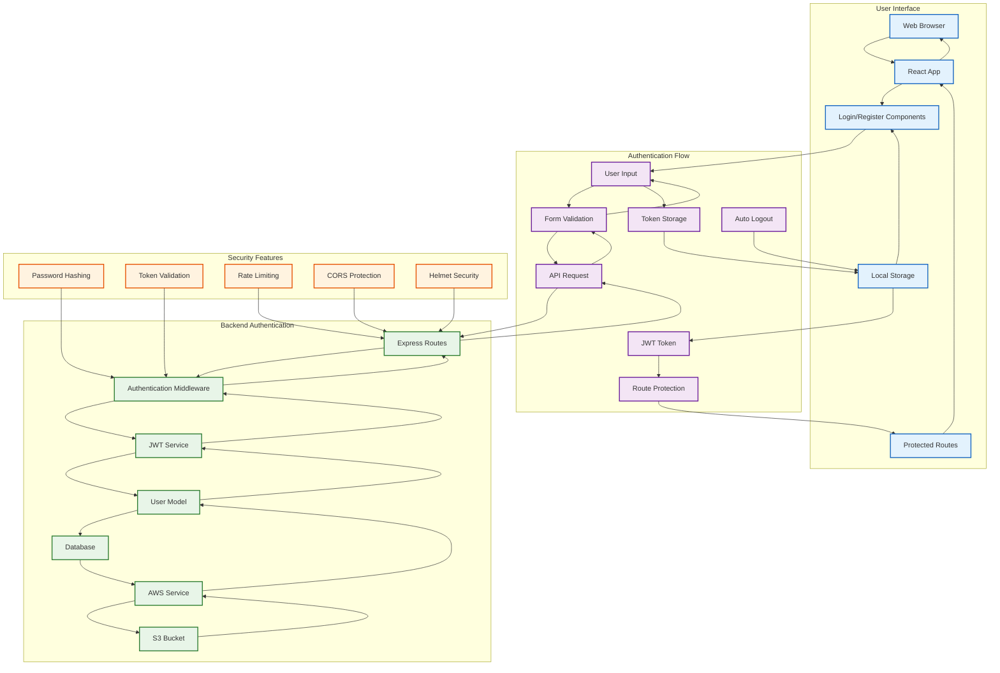
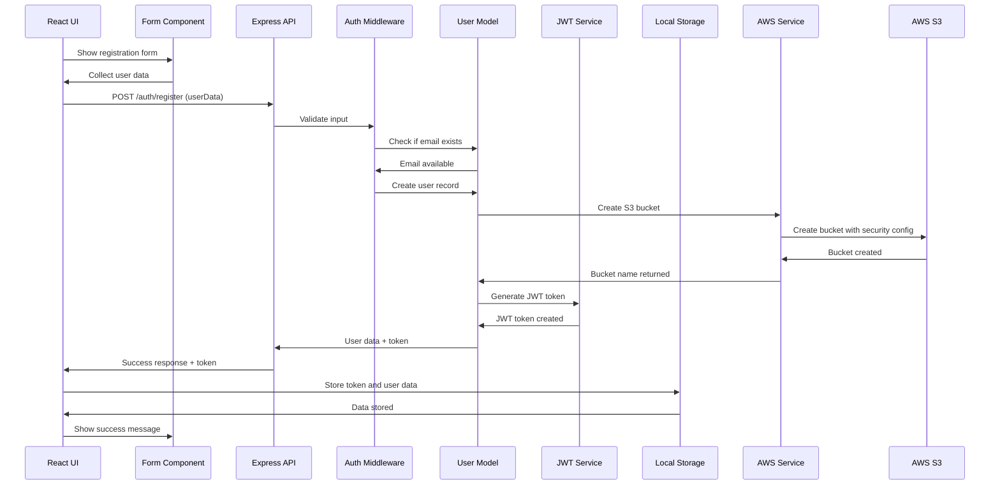
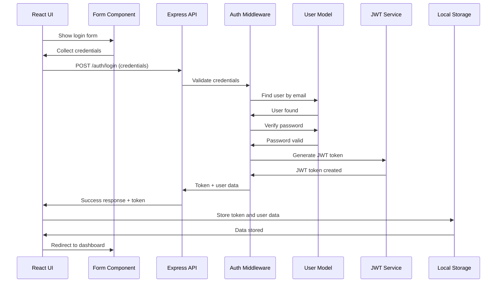
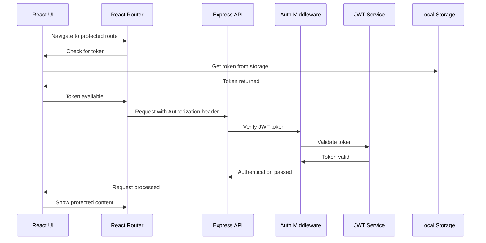
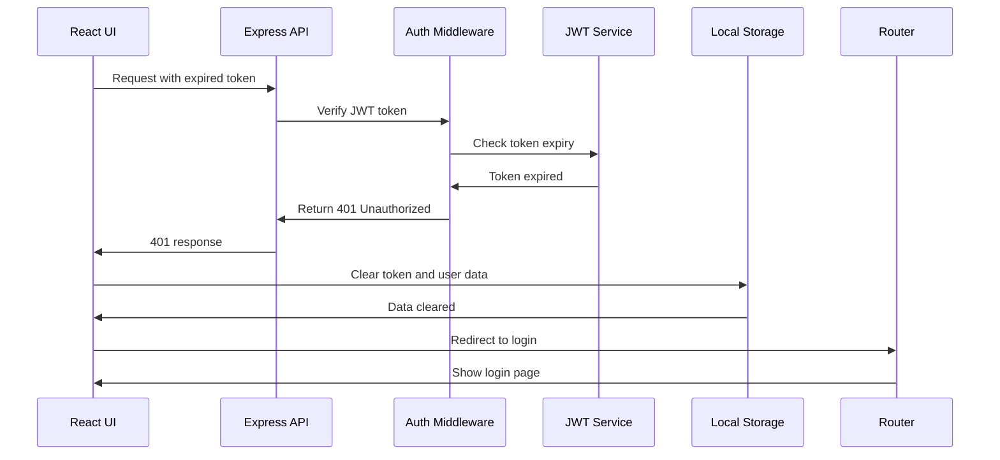
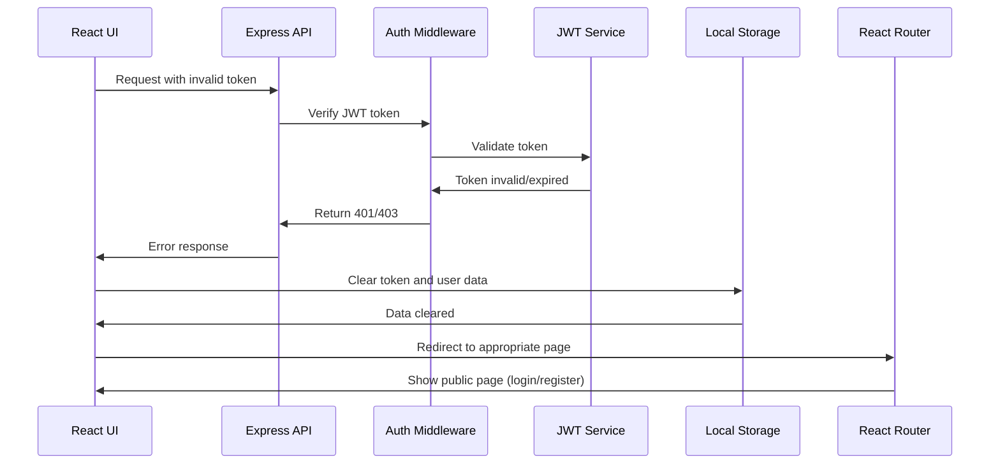
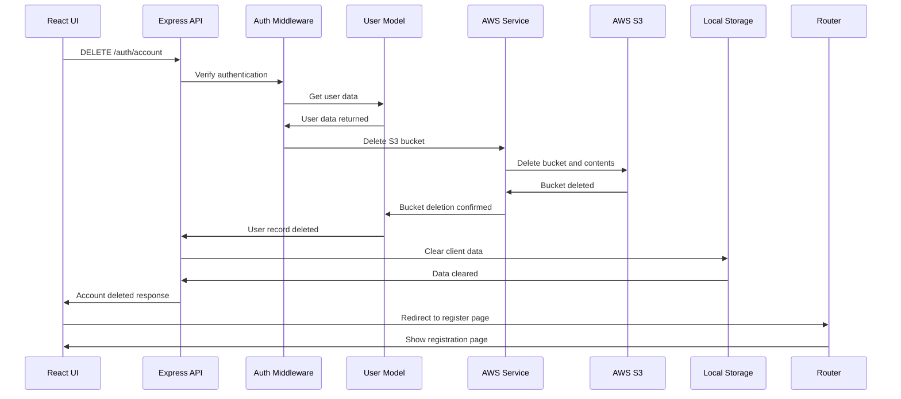
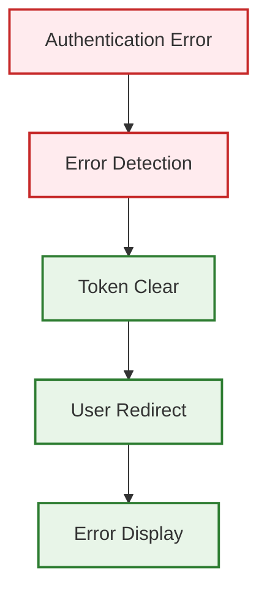

# SkyCrate User Authentication Flow

## Authentication Flow Overview



## Authentication Sequence Diagrams

### 1. User Registration Flow


### 2. User Login Flow


### 3. Protected Route Access Flow


### 4. Token Refresh Flow


### 5. Auto Logout Flow


### 6. Account Deletion Flow


## Authentication Components

### Frontend Authentication Components
- **Login Component** ([`src/components/Login.js`](src/components/Login.js)): User login interface
- **Register Component** ([`src/components/Register.js`](src/components/Register.js)): User registration interface
- **Protected Route Component** ([`src/App.js`](src/App.js)): Route protection logic
- **API Service** ([`src/services/api.js`](src/services/api.js)): JWT token management

### Backend Authentication Components
- **Auth Routes** ([`server/routes/auth.js`](server/routes/auth.js)): Authentication endpoints
- **Auth Middleware** ([`server/middleware/auth.js`](server/middleware/auth.js)): JWT verification
- **User Model** ([`server/models/User.js`](server/models/User.js)): User data management
- **AWS Service** ([`server/services/awsService.js`](server/services/awsService.js)): Bucket creation/deletion

### Security Middleware
- **Helmet Security** ([`server/middleware/security.js`](server/middleware/security.js)): Security headers
- **CORS Protection** ([`server/middleware/security.js`](server/middleware/security.js)): Cross-origin requests
- **Rate Limiting** ([`server/middleware/security.js`](server/middleware/security.js)): Request throttling

## JWT Token Management

### Token Structure
```json
{
  "userId": "user-uuid",
  "email": "user@example.com",
  "bucketName": "skycrate-user-uuid-timestamp",
  "iat": 1640995200,
  "exp": 1641004800,
  "jti": "token-uuid"
}
```

### Token Flow
1. **Generation**: Created during login/registration
2. **Storage**: Saved in localStorage on client side
3. **Usage**: Added to Authorization header for API requests
4. **Validation**: Verified on each protected request
5. **Expiry**: Automatically refreshed or user re-authenticates

## Security Features

### 1. Password Security
- **Hashing**: Secure password hashing (bcrypt)
- **Salt**: Random salt generation for each password
- **Verification**: Secure password comparison

### 2. Token Security
- **JWT**: JSON Web Token standard
- **Expiry**: Automatic token expiration
- **Signing**: Digital signature verification
- **Revocation**: Token invalidation on logout

### 3. Request Security
- **HTTPS**: Encrypted communication
- **CORS**: Restricted cross-origin requests
- **Rate Limiting**: Protection against brute force
- **Headers**: Security headers (Helmet)

### 4. Data Security
- **Encryption**: AES256 encryption for S3 objects
- **Access Control**: Bucket ownership enforcement
- **Public Access Block**: Prevents accidental public access
- **Input Validation**: Sanitization and validation

## Error Handling in Authentication

### Common Authentication Errors
1. **Invalid Credentials**: 401 Unauthorized
2. **Token Expired**: 401 Unauthorized with auto-redirect
3. **Token Invalid**: 403 Forbidden
4. **User Not Found**: 404 Not Found
5. **Bucket Not Found**: 404 Not Found with redirect to register

### Error Recovery Flow


## Authentication Configuration

### Environment Variables
```env
JWT_SECRET=your-secret-key-here
NODE_ENV=development
CLIENT_ORIGIN=http://localhost:3000
```

### JWT Configuration
- **Algorithm**: HS256 (HMAC using SHA-256)
- **Expiry**: 24 hours (configurable)
- **Issuer**: SkyCrate Application
- **Audience**: SkyCrate Users

This authentication flow provides a secure, user-friendly experience with proper error handling, automatic token management, and comprehensive security measures throughout the application.